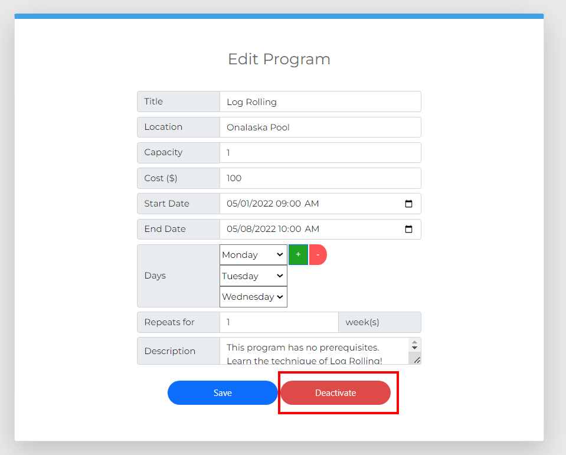
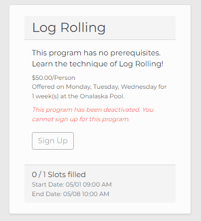

Deactivating a Program
======================

While programs in the system may not be deleted, they may be deactivated to prevent users from signing up for them.  This page will explain how to deactivate a program and the consequences of doing so.

1. Navigate to the Programs page and click the pencil icon of the program you would like to deactivate.

.. image:: img/editprogram1.png

.. image:: img/editprogram2.png

2. Click the red "Deactivate" button.  

3. A prompt will ask you to confirm the deactivation.  Please review the following before going through with the deactivation.

- A program cannot be reactivated after its deactivation.
- A program cannot be edited after its deactivation.
- A program can still be seen on the Programs page by Staff members after its deactivation, with a message that it has been deactivated.
- Deactivating the program will cause any enrollments associated with the program to be cancelled.
- Any users who have enrolled in the program prior to its deactivation will see the program in their Enrollments with a message that it has been deactivated.

If you would like to proceed, confirm your decision by clicking "Deactivate" in the prompt.

.. image:: img/deactivateprogram4.png

After deactivating the program, it will appear on the Programs page with all of its enrollments removed.

