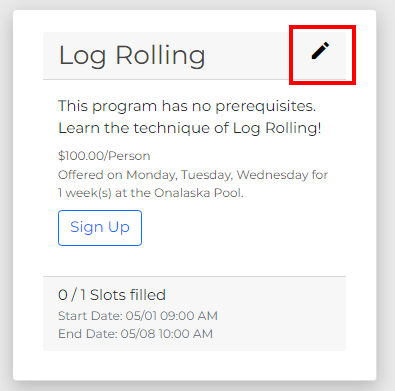
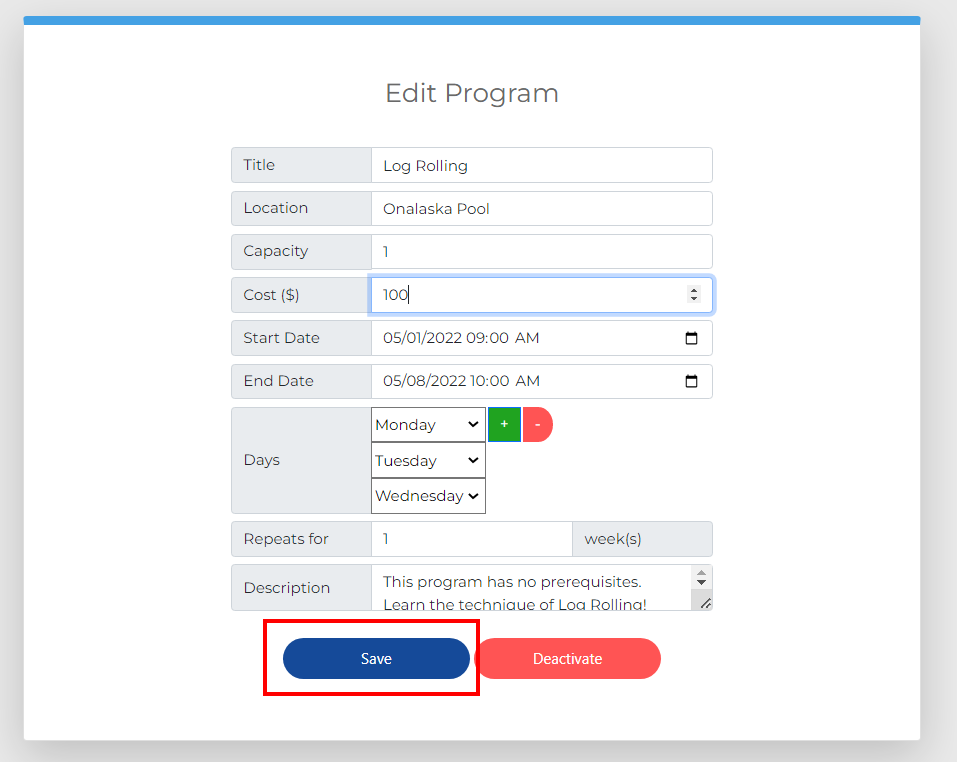

Editing a Program
=================

As a Staff member, you will sometimes need to edit programs after they are already created.  This page will guide you on how to do so.

1. Navigate to the Programs page and find the program you would like to edit.  Click the "Edit..." button next to the title of the program.

2. You will see the program's information, ready to be edited.  Make your desired changes and click the "Save" button.

You will see an indication that the program has been saved.  These changes will be reflected in the Programs page.  If you would like to deactivate a program, see :doc:`deactivateprogram`.