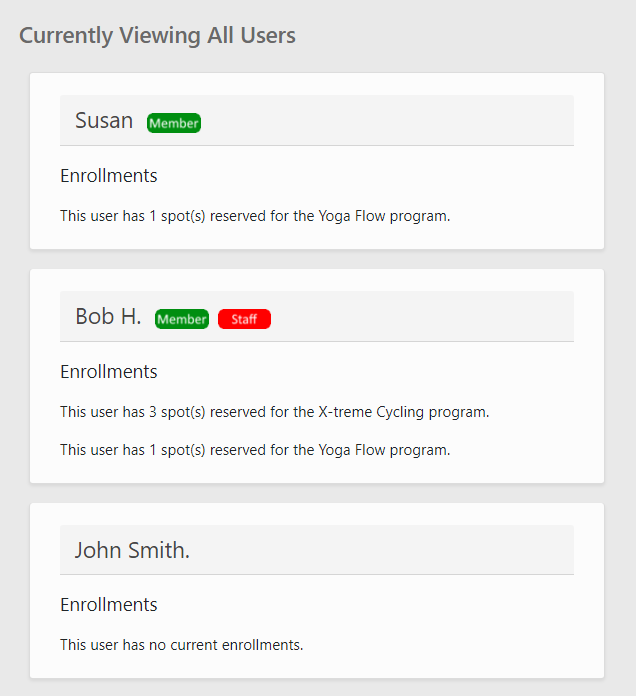
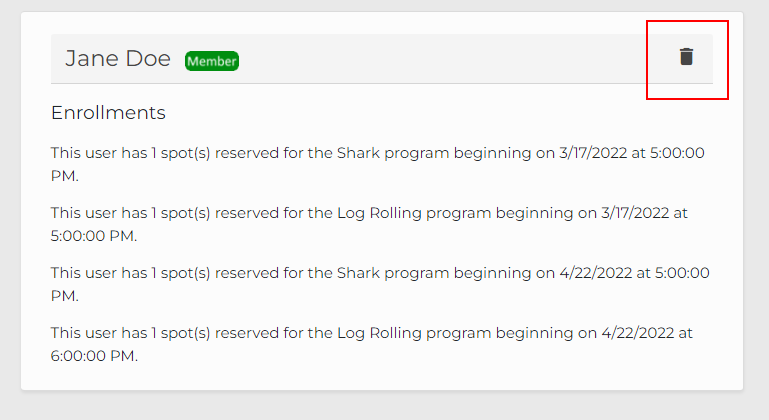
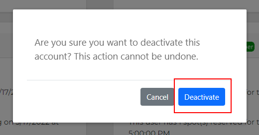
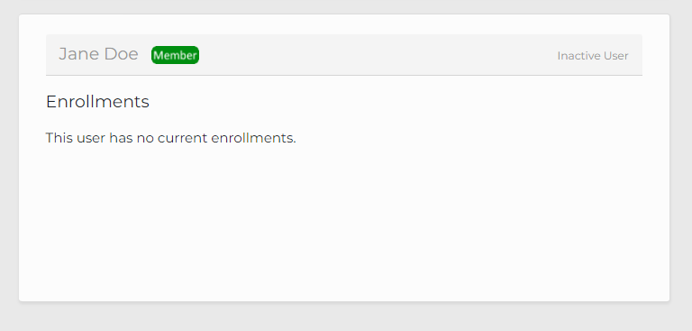

Deactivating a User's Account
=============================

If a user has violated our service policy, you will be instructed to deactivate the user's account.  Here are instructions on how to properly deactivate the account of any user.

1. Log into your account and click the "Users" link at the top of the application.

2. You will be greeted with a list of users, their credentials, and their current enrollments.

3. Click the Deactivate icon in the right-hand corner of the user you would like to deactivate.

4. You will be prompted to confirm your decision.  Please read the following before continuing.

- Any of the user's future enrollments will be canceled and invalid for participation.
- The user no longer be able to log into their account.
- You will not be able to reactivate the user's account after it is deactivated.

If you would like do proceed, click "Deactivate" in the prompt.

The user will appear as inactive, and their enrollments will be canceled.

Please note that you cannot deactivate your own account in this way.  Refer to the Profile page to deactivate your own account.