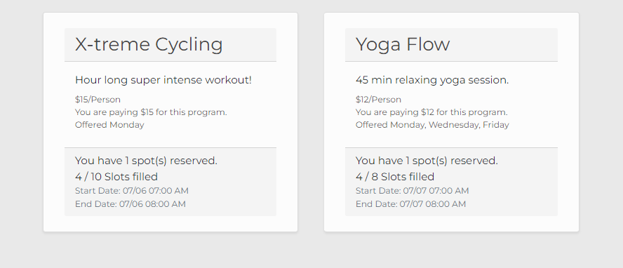

Viewing your Enrollments
========================

After you have signed up for programs, you will be able to see them from within the MyMCA application.  If you have not yet signed up for a program, see :doc:`program`. Continue reading for instructions on how to see your current program enrollments.

1. If you have not done so already, sign into your account using your login information.  See :doc:`accountcreation` and :doc:`login` for more details.

2. At the top of the application, click the "Enrollments" link.

3. You will be greeted with a list of your current program enrollments.  You can see when they are offered, how much you are paying per session, and how many spots you currently have reserved.

If you would like to cancel one or more of your current enrollments, please contact a Staff member and they will assist you.