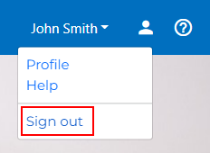

Logging In/Out
==============

This page will instruct you on how to log in and out of your account.  If you need to create an account for MyMCA, please see :doc:`accountcreation`.

Logging into your Account
-------------------------

1. Visit the MyMCA Login page.  Enter your account information and click the "Log in" button.  If you entered your information correctly, you will be logged in.

If you are unable to log into your account using your information, please contact a Staff member for assistance.

Logging out of your Account
---------------------------

1. After you are logged in, you will see your information in the top-right corner of the application.  Click "Sign out" to log out of your account.

