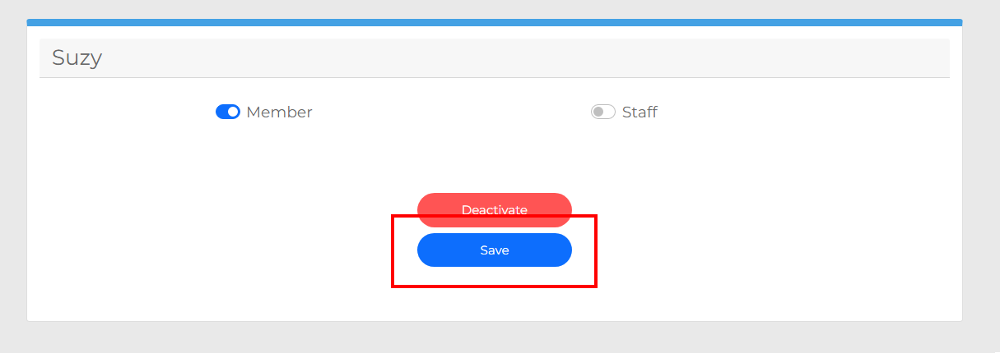

Changing Profile Information
============================

If your information needs to be changed while using MyMCA, you can change it from within the application.  Continue reading to learn how to change your profile information.

1. If you have not done so already, sign into your account using your login information.  See :doc:`accountcreation` and :doc:`login` for more details.

2. In the top-right corner of the application, you will be able to access the Profile page by clicking on the profile icon.

.. image:: img/profile1.png

3. Update your program information and click the Save button.

4. You will see a message that confirms you have updated your profile information.  These changes will immediately be reflected within the application.

Please be aware that Staff members will periodically validate the states of user accounts.  Changing your account state without proper Staff authorization will result in account deactivation or permanent suspension.  If you believe your account has been deactivated by mistake, please contact a Staff member for assistance.

If you would like to stop using the MyMCA service and deactivate your own account, please see :doc:`deactivate`.