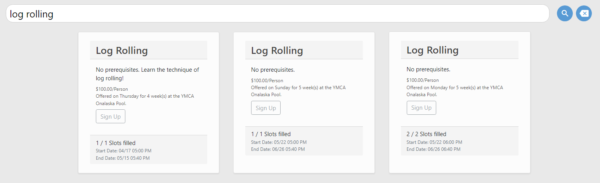
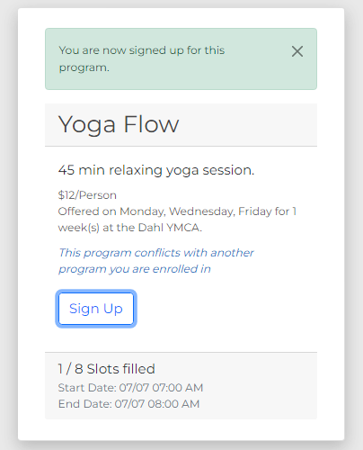

Signing Up for a Program
========================

Signing up for programs through MyMCA will help you and your family to stay active and make great memories.  Continue reading for instructions on how to sign up for programs using MyMCA.

1. If you have not done so already, sign into your account using your login information.  See :doc:`accountcreation` and :doc:`login` for more details.

2. At the top of the application, click the "Programs" link.

.. image:: img/program1.png

3. You will be greeted with a list of programs that are currently being offered.  Members will see programs at a discounted price.

You can also search for a program by entering a term in the search bar and clicking the "Search" button.

To clear your search, simply hit the "Clear" button.

.. image:: img/program7.png

4. Choose a program that works for you and click the "Sign Up" button.

.. image:: img/program2.png

5. You will be prompted to enter your first name to register the enrollment under.  Enter your name and click "Enroll".

6. You will see a message that confirms you have reserved a slot in the program.  If you have family members that are also attending the program, **please reserve one slot per person**.

You are now signed up for your program!  Your program fee will be collected upon your arrival.  Keep in mind that member discounts are automatically applied to your account.  For information on seeing your current program enrollments, see :doc:`enrollmentviewing`.